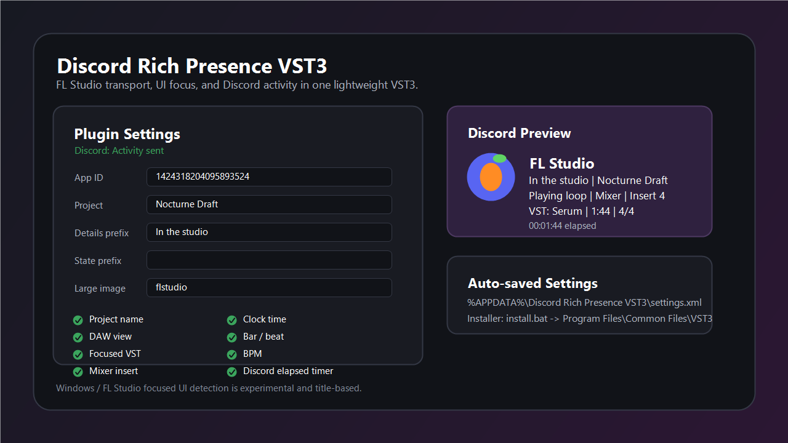

# Discord Rich Presence VST3

Discord Rich Presence VST3 is a lightweight Windows VST3 utility plugin that publishes DAW transport and FL Studio UI context to Discord Rich Presence.

It is built for FL Studio workflows, but the basic transport fields can work in other VST3 hosts when the host exposes playhead data.



## Features

- Discord Rich Presence via Discord desktop IPC
- Custom Discord Application ID
- Auto-detected FL Studio project name from the main window title
- Custom project name fallback
- DAW/host name
- Play, stop, record, and loop state
- Current transport time
- Bar and beat when the host exposes PPQ position
- BPM and time signature
- Optional sample rate
- Optional Discord elapsed timer
- Experimental FL Studio UI detection:
  - Playlist
  - Mixer
  - Piano roll
  - Channel rack
  - focused/clicked VST window
  - mixer insert when visible in the host window title
- Auto-saved global settings
- Portable build script with no Visual Studio installation required

## Demo Output

Example Discord activity:

```text
FL Studio
In the studio | Nocturne Draft
Playing loop | Mixer | Insert 4
VST: Serum | 1:44 | 4/4
```

## Install

Close FL Studio or any other DAW first. Windows may lock the VST3 file while the plugin is loaded.

Double-click:

```text
install.bat
```

The installer will:

- request administrator permission if needed
- download portable build tools into `.tools`
- build the VST3
- install it to `C:\Program Files\Common Files\VST3`
- verify that Windows can load the installed plugin DLL

Installed plugin path:

```text
C:\Program Files\Common Files\VST3\Discord Rich Presence.vst3
```

After installing, open FL Studio and rescan VST3 plugins if it does not refresh automatically.

## Settings

Plugin settings are saved globally here:

```text
%APPDATA%\Discord Rich Presence VST3\settings.xml
```

This keeps your Discord Application ID, toggles, project fallback name, prefixes, and image keys from resetting when you create a new project.

Default Discord Application ID:

```text
1424318204095893524
```

## Discord Assets

`large_image` and `small_image` must match image asset keys uploaded in the Discord Developer Portal for the same Application ID.

Leave image key fields blank if you do not use custom Discord assets.

## Build Manually

Portable build, no Visual Studio install:

```powershell
.\scripts\build-portable.ps1
```

Build and install:

```powershell
.\scripts\build-portable.ps1 -Install
```

Visual Studio/CMake build:

```powershell
cmake -S . -B build -G "Visual Studio 17 2022" -A x64
cmake --build build --config Release
.\scripts\build.ps1 -Install
```

Portable build tools are stored under:

```text
.tools\
```

Build output:

```text
build-portable\DiscordRichPresence_artefacts\Release\VST3\Discord Rich Presence.vst3
```

## Limitations

VST3 does not provide a standard API for every DAW UI detail. Project name, selected panel, focused plugin, and mixer insert detection are best-effort Windows/FL Studio window-title detection.

Reliable data:

- host transport time when exposed by the DAW
- play/stop/record/loop state when exposed by the DAW
- BPM and time signature when exposed by the DAW

Best-effort data:

- FL Studio project name
- current panel such as Playlist, Mixer, or Piano roll
- focused/clicked VST window
- selected mixer insert

## Troubleshooting

If FL Studio says the plugin cannot be opened:

1. Close FL Studio.
2. Run `install.bat` again.
3. Open FL Studio.
4. Rescan VST3 plugins.

If the installer cannot copy the plugin, FL Studio or another DAW is still using the old VST3 file. Close the DAW completely, then install again.

If Discord still shows old text or a bad timer, disable and enable presence in the plugin, or restart Discord desktop.

## Repository Layout

```text
Source/                 VST3 source code
scripts/build-portable.ps1
scripts/install.ps1
install.bat             double-click installer
assets/demo.png         README demo image
```
